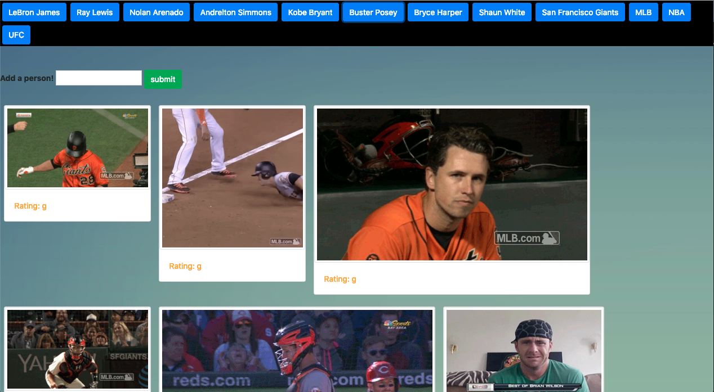

# 06- Ajax Homework: GifTastic Assignment 

* Link to assignment: https://xieandrew2235.github.io/GifTastic/

For this assignment we had to create a page that loaded GIFs from an array, and also dynamically as users added to the array via inputting names into the form and submitting. I chose to start out with a sports theme, with individual superstars and ending with leagues (NFL, NBA, etc). 

When the user either clicks on a pre-generated or user-generated button, 10 gifs from Giphy with the tag will be displayed, along with its movie rating. When the user clicks on the still GIF, it will play, and if the user clicks on it again, it will pause. The user can search up as many names as it pleases, and 10 new gifs will be displayed on the screen, replacing the previous selection.

For styling I added a background image and some colors to the page, but nothing out of the ordinary. For the GIFs they are put into cards, which are split into the GIF and the rating.

## What I wanted to do that I didn't do

* Fixed sizes for the GIFs. If you take a look at the generated GIFs, you'll notice that they come in all shapes and sizes, which I tried to fix but most that I tried didn't make any changes, and I also tried talking with some classmates about it, to no avail. Google also didn't have much to provide when I tried looking up "how to limit size of giphy API generated GIFs" or something similar. 